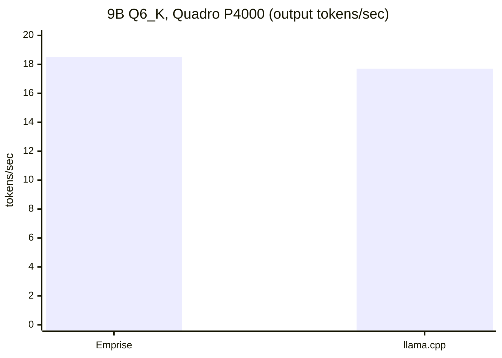

# Emprise

A C++ inference engine for running local GGUF language models well on limited
hardware — older GPUs, modest VRAM, ordinary CPUs. It is a from-scratch engine
(not a wrapper around llama.cpp).

## What it can do

- **Runs local GGUF language models** for text generation.
- **CPU and NVIDIA CUDA** execution, chosen automatically from detected hardware.
- **Exact FP32 activations by default.** Weights are decoded at full precision;
  no activation quantization is required. Output is deterministic — the same
  input always produces the same tokens.
- **Greedy streaming generation** with a 4,096-token context.
- **Works on old GPUs.** CUDA kernels are compiled at runtime with NVRTC and
  support compute capability 6.1+ (tested on a Quadro P4000, Pascal).
- **Optional Q8 activation kernel** (`--fast-q8`) for a small speed/accuracy
  trade-off.

It does **not** have a GUI, an HTTP server, or a model downloader. It is a
command-line tool for people who already have a GGUF model.

## Supported models and hardware

| | Supported now | Notes |
|---|---|---|
| Architecture | `qwen35` (Qwen3.5) | only architecture implemented |
| Weight format | Q6_K (tested); FP32, FP16, BF16 decoding | model execution exercised with Q6_K + FP32 |
| GPU | NVIDIA, compute capability 6.1+ | custom kernels via NVRTC |
| CPU | x86-64 with OpenMP | GPU not required |
| OS | Windows, Linux | built and tested on Windows 10 |

## Performance

Measured on a Quadro P4000 8 GB with a 9B Q6_K model, 128 generated tokens,
exact FP32 activations:



| Model | Hardware | Backend | Speed |
|---|---|---:|---:|
| 9B Q6_K | Quadro P4000, 16 CPU threads | CUDA | ~18.5 tok/s |
| 9B Q6_K | Quadro P4000 | CPU (CUDA off) | slower |

Speed depends on the model and the memory bandwidth of your GPU. A rough rule:
output speed is bounded by reading the model's weights once per token, so
`model size ÷ memory bandwidth` is the ceiling.

## Build

Requirements: CMake 3.24+, a C++20 compiler, and OpenMP. For GPU execution, the
NVIDIA driver plus the CUDA 12 NVRTC runtime. For Pascal GPUs use CUDA 12.9 or
earlier (CUDA 13 dropped Pascal).

Windows (Visual Studio 2022 Build Tools, Desktop C++):
```powershell
cmake -S . -B build -G "Visual Studio 17 2022" -A x64
cmake --build build --config Release --parallel 4
```

Linux:
```sh
cmake -S . -B build -DCMAKE_BUILD_TYPE=Release
cmake --build build -j4
```

If NVRTC is not on the library search path, point to it:
```
EMPRISE_NVRTC_LIBRARY=/path/to/nvrtc64_120_0.dll
```

## Use

You need a GGUF model file. Point the tools at it:

```text
# Chat (GPU is used automatically when available)
emprise-chat --model model.gguf --prompt "Explain how a refrigerator works." --tokens 128

# Force CPU only
emprise-chat --model model.gguf --prompt "Hello" --cpu --threads 16

# Inspect a model's tensors and types without loading weights
emprise-inspect model.gguf
```

Common options for `emprise-chat`:

| Option | Meaning |
|---|---|
| `--model FILE` | path to the GGUF model (required) |
| `--prompt TEXT` | prompt to send (default: a built-in example) |
| `--tokens N` | number of tokens to generate (default 32) |
| `--context N` | total context size (default 4096) |
| `--cpu` | disable the GPU |
| `--threads N` | CPU worker threads |
| `--fast-q8` | use the faster, slightly lossy Q8 activation path |
| `--ram-mib N` | cap resident weight RAM |
| `--vram-mib N` | cap GPU weight memory |
| `--report FILE` | write a JSON timing report |
| `--tokenize` | print token IDs and exit |
| `--raw` | bypass the built-in chat wrapper |

Example report:
```powershell
emprise-chat --model model.gguf --prompt "Write a C++ function to dedupe a vector." --tokens 256 --report run.json
```

## Limitations

- One model architecture (`qwen35`) and only Q6_K execution tested end-to-end.
- Greedy decoding only; no sampling, beam search, or speculative decoding yet.
- One conversation per process; the engine is not yet thread-safe across sessions.
- NVIDIA is the only GPU backend. Other vendors, multi-GPU, and vision are not
  implemented.

## License

MIT. See [LICENSE](LICENSE).
